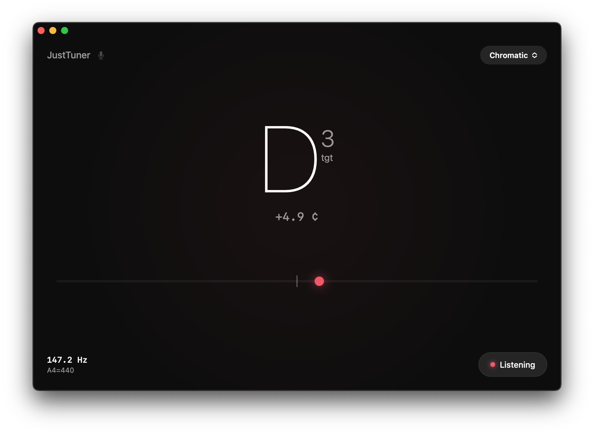

# JustTuner 🎸
> A minimalist, high-precision instrument tuner for macOS.

---

### ✨ Key Features

* **Instant Device Selection:** Click the mic icon in the header to switch between input sources (Internal Mic, Audio Interfaces, etc.) without leaving the main view.
* **Custom Tuning Engine:** Fully customizable tuning presets. Go beyond Chromatic mode and create your own specific tunings for any instrument.
* **Extended Low-Frequency Support:** Optimized pitch-detection algorithms that handle the unique physics of 8-string guitars and bass guitars with zero "flicker" or latency issues.
* **Pro-Level Accuracy:** Real-time feedback with precise frequency (Hz) display and cent-offset tracking relative to A4=440Hz.
* **Modern Dark Interface:** A minimalist, high-contrast UI designed for studio environments and dark stages.

### 🚀 Installation
Since this app is not distributed through the Mac App Store, follow these steps:

1. **Download** the latest `.dmg` from the [Releases](https://github.com/Engylizium/JustTuner/releases) page.
2. **Drag** JustTuner to your Applications folder.
3. **Right-click** the app and select **Open** (required to bypass macOS security for independent developers).

---

### 🛠 Tech Stack

* **UI Framework:** SwiftUI (Modern, reactive interface)
* **Audio Logic:** AVFoundation & CoreAudio (Low-latency input routing)
* **Signal Processing:** Accelerate Framework (High-performance FFT for pitch detection)
* **Reactive Programming:** Combine (Seamless data flow between audio engine and UI)
* **Core Utilities:** Foundation

---

### 📄 License
This project is licensed under the MIT License - see the [LICENSE](LICENSE) file for details.
